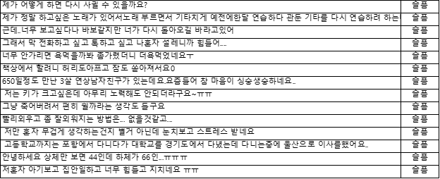

## Text mining for classifying emotion with Natural language processing 

  

#### Goal  
To find out emotion(기쁨, 슬픔, 놀람, 분노, 공포, 혐오, 중립) from short Korean sentences through supervised learning

#### Evaluation metrics  
Accuracy & F1 score (precision)

#### The way to get data  
  * Data link: [AI hub site](http://www.aihub.or.kr/keti_data_board/language_intelligence)
  * company in charge : ㈜ 아크릴

#### Data description  
  * Sentences were crawled from SNS and online comment(from portal site)
  * Each sentece was seperated(Each sentece has its **own emotion label**)
  * data number: 38,594 sentences
  * length of each sentence : 23.7±13.6자
  * Words of each sentence : 5.3 ± 3.1
  
    

  
#### Emotion labels proportion

  공포 |놀람 |분노 |슬픔 |중립 |행복 |혐오 |sum      
  --- | --- | --- | --- | --- | --- | --- |---
  |0.156423|0.152822|0.146784|0.141680|0.140670|0.136472|0.125149|1

  * --> **little imbalance**

#### The whole process for classification  
  * Preprocessing  
    * Remove emoticon or punctuations(Remove all except words)  
    --> Because emoticon is used to emphasize emotion and this project deosn't seperate emotion that specifically.

    * Tokenization with '(space)' using KoNLPy 
    * Remove stopword
    * Embedding (changeing words into int)
    * Padding(matching size)

  * Modeling
    * Machine learning model(for comparison)  
      Naive Bayes, Support vector machine

    * Deep learning  
     CNN
  

  * Evaluation  
    * Accuracy for each instances(emotions) and its average 
    * F1 score especially, precision
    $accuracy,A = 1 \over n {\sum_{i=1}^n {\mid Y_i \cap Z_i \mid \over \mid Y_i \cup Z_i \mid}}$

#### Difficulties of the data
  * In the preprocessing, there are a lot of typos.  
  --> Add a step: without tokenization, making charactor based n-gram(n = 4~8)    
   ###### _김유영, & 송민. (2016). 영화 리뷰 감성분석을 위한 텍스트 마이닝 기반 감성 분류기 구축. 지능정보연구, 22(3), 71-89._

